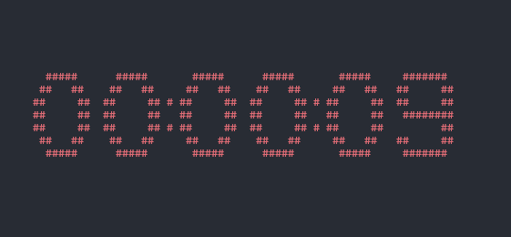

# Description
Countdown for your CLI.

# Features
- set countdowns for up to 59 minutes 59 seconds;
- the timer starts blinking red during the last 10 seconds of the countdown;

# Usage
This application depends on [urwid](https://github.com/urwid/urwid) so you need that installed.
See the help on how to use the application by running
```
python main.py -h
```
